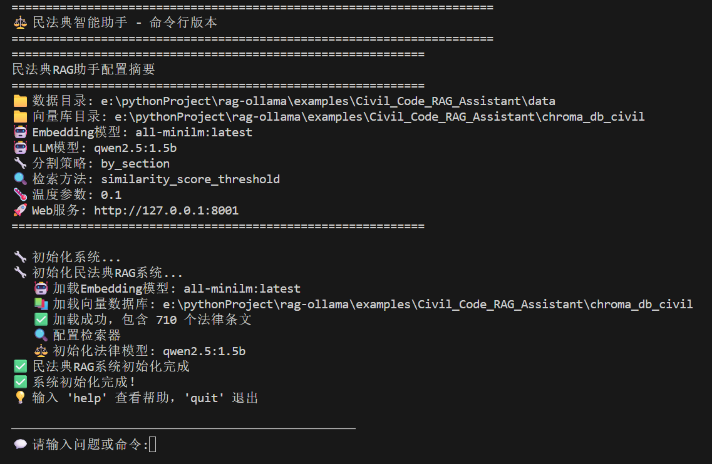

# 民法典RAG智能助手

基于RAG架构的《中华人民共和国民法典》智能问答系统。

## 功能特点

- 📚 **全面覆盖**：基于完整的民法典条文
- 🔍 **精准检索**：优化的法律文本检索算法
- ⚖️ **专业解答**：严谨的法律解释和建议
- 🚀 **完全本地**：数据隐私安全，无需联网
- 💬 **实时交互**：流式响应，即时解答

## 快速开始

### 1. 新的目录结构

```
📁 项目根目录/
├── 📁 examples/Civil_Code_RAG_Assistant/  # 民法典助手专用
│   ├── 📁 configs/          # 专用配置文件
│   │   ├── civil_config.py
│   │   └── __init__.py
│   ├── 📁 processors/       # 专用处理器
│   │   ├── civil_ingest.py
│   │   └── __init__.py
│   ├── 📁 prompts/         # 专用提示词
│   │   ├── civil_prompts.py
│   │   └── __init__.py
│   ├── 📁 rag/             # 专用RAG引擎
│   │   ├── civil_rag.py
│   │   └── __init__.py
│   ├── 📁 web/             # 专用Web组件
│   │   ├── civil_app.py
│   │   └── __init__.py
│   ├── 📁 data/            # 示例数据（可选）
│   │   └── 民法典.pdf
│   ├── requirements_civil.txt  # 专用依赖
│   ├── run_civil.py       # 一键启动脚本
│   ├── civil_cli.py       # 命令行系统界面
│   └── README.md          # 使用说明
├── 📁 原有项目文件/        # 原有通用RAG系统
│   ├── app.py
│   ├── config.py
│   ├── ingest.py
│   ├── rag.py
│   ├── prompts.py
│   ├── requirements.txt
│   └── ...
└── requirements.txt       # 基础依赖（共享）
```


### 2. 环境准备

```bash
# 进入项目目录
cd examples/Civil_Code_RAG_Assistant

# 安装依赖
pip install -r requirements_civil.txt

# 确保Ollama服务运行
ollama serve

# 下载所需模型
ollama pull nomic-embed-text
ollama pull qwen2.5:7b  # 或使用其他模型
```

### 3. web界面


### 4.命令行界面

