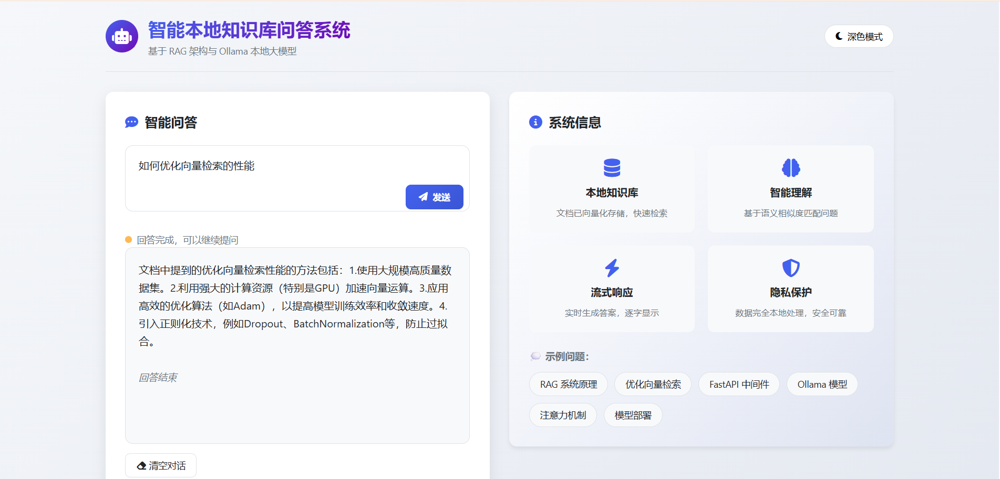

# 📚 本地 RAG 系统（LangChain + Ollama）

## 1. 项目简介
本项目实现了一个 **完全本地运行的 RAG（检索增强生成）系统**，  
基于 LangChain 1.x + Ollama + Chroma，支持 **流式输出 + Web 交互**。

webapp界面：


---

## 2. 模型依赖
本地安装ollama应用程序

- LLM: qwen2.5:1.5b
- Embedding: nomic-embed-text

```bash
ollama pull qwen2.5:1.5b
ollama pull nomic-embed-text
```

## 3. 安装依赖

项目结构：

```
rag-ollama/
├── app.py                # FastAPI Web 服务（流式输出）
├── rag.py                # RAG 系统主逻辑
├── ingest.py             # 文档入库脚本
├── prompts.py            # Prompt 模板
├── config.py             # 统一配置
├── requirements.txt      # Python 依赖
├── README.md             # 项目说明
├── data/                 # 原始文档（txt/pdf）
└── chroma_db/            # 向量数据库（自动生成）
├── templates/
│   └── index.html        # HTML界面文件
└── static/               # 静态资源目录（可选）
    ├── css/
    ├── js/
    └── images/
```

安装依赖：

```
pip install -r requirements.txt
```

------

## 4. 文档入库

将 `.txt` 文件放入 `data/` 目录，然后运行：

```
python ingest.py
```

------

## 5. 启动 Web 服务

```
uvicorn app:app --reload
```

访问：

```
http://127.0.0.1:8000
```
